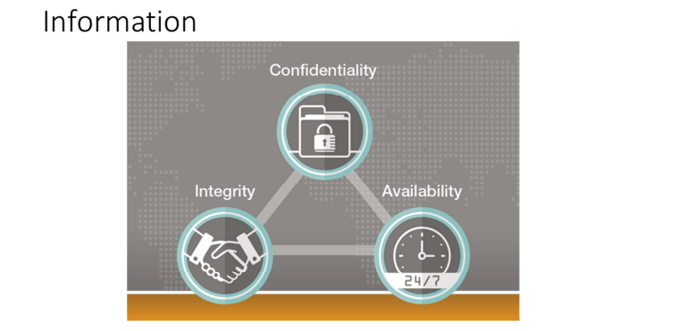

# Domain 5: Identity and Access Management (IAM)
**_Weightage:_** _13%_

Identity and access management (IAM) are core to maintaining confidentiality,
integrity, and availability of assets and resources that are critical to business survival and function. Central to maintaining protection of business-critical assets is the
ability to name, associate, and apply suitable identity and access control
methodologies and technologies that meet specific business needs.  

  

Information and the administration of information is key to the management of
individual and systemic access control systems. Information can be associated with
both logical and physical access control systems. Whether it is a logical or physical
access system, the control of that system is maintained somewhere as discrete data
and/or information. The management of information related to physical and logical
access is accomplished in three primary ways, namely:

- centralized, 
- decentralized, 
- and hybrid.

  

**Centralized–** Centralized administration means that one element is responsible for
configuring access controls so that users can access data and perform the activities
they need to. As users’ information processing needs change, their access can be
modified only through central administration, usually after requests have been
approved through an established procedure and by the appropriate authority. The
main advantage of centralized administration is that very strict control over
information can be maintained because the ability to make changes resides with
very few persons. Each user’s account can be centrally monitored, and closing all
access for any user can be easily accomplished if that individual leaves the
organization. Consistent and uniform procedures and criteria are usually not
difficult to enforce, since relatively few individuals oversee the process.  

**Decentralized–** In contrast to centralized administration, decentralized
administration means that access to information is controlled by the owners or
creators of the files, whoever or wherever those individuals may be. An advantage
of decentralized administration is that control is in the hands of the individuals most accountable for the information, most familiar with it, and best able to judge who
should be able to do what in relation to it. One disadvantage, however, is that there may not be consistency among creators/owners as to procedures and criteria for
granting user access and capabilities. Another disadvantage is that
when requests are not processed centrally, it may be more difficult to form a systemwide view of all user access on the system at any given time. Different data owners
may inadvertently implement combinations of access that introduce conflicts of
interest or that are in some way not in the organization’s best interest. It may also be difficult to ensure that access is properly terminated when an employee transfers
within, or leaves an organization.  

**Hybrid–** In a hybrid approach, centralized control is exercised for some information
and decentralized is allowed for other information. One typical arrangement is that
central administration is responsible for the broadest and most basic access, and the
creators/owners of files control the types of access or users’ abilities for the files
under their control. For example, when a new employee is hired into a department, a central administrator might provide the employee with a set of access perhaps based on the functional element they are assigned to, job classification, and the specific
task the employee was hired to work on. The employee might have read-only access
to an organization-wide SharePoint document library and to project status report
files, but read and write privileges to his department’s weekly activities report. Also,
if the employee left a project, the project manager can easily close that employee’s
access to that file.  

#
  

### Systems  
Access controls can be classified by either logical or physical systems. The simplest
example of a physical access control system is a door that can be locked, limiting
people to one side of the door or the other. A logical access control system is
normally operational in an office network where users are allowed or not allowed
to login to a system to access data labeled with a classification by users granted a
clearance.  

### Access Controls and Administration  
**ISO/IEC 27000:2016(E)** defines access control as a “means to ensure that access to
assets is authorized and restricted based on business and security requirements.”
These requirements will be formalized in the organizational policy that is pertinent
to individual organizations. Two primary system types that form access controls are
physical and logical. Each type requires administration that can have various
degrees of involvement from senior management regarding risk based decisions
concerning the organizational risk appetite and profile, the data owner concerning
“need-to-know” and “least privilege” and asset value determination, the custodian
concerning tool implementation to provide appropriate restriction of the assets to  disclosure, destruction, or alteration.  
#
  
The Federal Identity, Credential, and Access Management (FICAM) defines logical
access control as: “An automated system that controls an individual’s ability to
access one or more computer system resources such as a workstation, network,
application, or database. A logical access control system requires validation of an
individual’s identity through some mechanism such as a Personal Identification
Number (PIN), card, biometric, or other token. It has the capability to assign
different access privileges to meet different persons depending on their roles and
responsibilities in an organization.” 

Logical access control requires more complex and nuanced administration than
physical. Before selection and implementation of the logical access control type, the data owner has classified and categorized the data. Categorizing the data will reveal
the impact that would occur if there is disclosure, alteration, or destruction.
Classifying the data will define the value of discreet assets and who should have
access and authorization. Logical access controls are often built into the operating
system, or may be part of the “logic” of applications programs or major utilities,
such as database management systems (DBMS). They may also be implemented in
add-on security packages that are installed into an operating system; such packages are available for a variety of systems, including PCs and mainframes. Additionally,
logical access controls may be present in specialized components that regulate
communications between computers and networks.

#
  
Special Publications 800-53r4 defines physical access control as “An automated
system that manages the passage of people or assets through an opening(s) in a
secure perimeter(s) based on a set of authorization rules.”  

### Devices  
There are a range of devices (systems or components if logical) associated with
logical and physical access control. Logical and physical access control devices
include but are not limited to access tokens (hardware and software), keys, and
cards.
#
  
  

### Access Control Tokens
Access control tokens are available in many different technologies and in many
different shapes. The information that is stored on the token is presented to a
reader that reads the information and sends it to the system for processing. The
token may have to be swiped, inserted, or placed on or near a reader. When the
reader sends information to the system, it verifies that the token belongs to the
system and identifies the token itself. Then, the system decides if access is to be
granted or denied based upon the validity of the token for the point where it is read based on time, date, day, holiday, or other condition used for controlling validation.
When biometric readers are used, the token or key is the user’s retina, fingerprint,
hand geometry, voice, or whatever biological attribute is enrolled into the system.
Most biometric readers also require a PIN to index the stored data on the sample
readings of the biological attribute. Biometric systems can also be used to
determine whether a person is already in a database, such as for social service or
national ID applications.  

#
 

At the development of the enterprise security architecture, the security architect
will map business requirements to technology agnostic views or statements that
enforce the security policy and answer business goals throughout the organization.
These architectural views or statements are what provide guidance for
implementation of cohesive technology solutions that come from specific design
elements that are informed by the architecture. Within the lifecycle of identity and
access provisioning, it is imperative that user access reviews are conducted on an
on-going basis once an account has been created and provisioned. The review will
be based upon the business requirements that are expressed within the enterprise
security architecture. Scheduled and regular user access reviews could reveal
vulnerabilities that might require the need for revocation, disablement, or deletion
of an account.  

These occurrences are causes for revocation/disablement/or deletion of user
access: 
- If a user is voluntarily or involuntarily terminated from an organization. 
- If an account has been inactive for a period that surpasses the organizational policy
- If the user account is no longer appropriate for the job description or role. 
- If user account privileges have experienced unnecessary access aggregation.

#
  

System accounts such as “administrator,” “sudo,” or “root” accounts present an
often-exploited vulnerability for attackers. Making a non-linear representation
between the user ID name and its function could represent the first layer of defense against attackers. Disconnecting the account name from the function is as simple as
renaming the account to something that looks more like a traditional user name or
randomly generated name. In addition to identifying an account by the name, an
attacker could also identify the account by other attributes such as system assigned
static numeric ID. Therefore, “security by obscurity” or only renaming the system
account is insufficient due diligence to protect them from anything more than trivial exploitation efforts.  

#
 

Provisioning and deprovision of access and identities involves a list of activities that
are driven by business needs and requirements, job function and role, asset
classification and categorization, and dynamic legal and regulatory issues. Users
needing access to system resources go through a process of provisioning that rightly begins with the data/information owner expressing a business need for the stated
access.  

Vulnerabilities that are readily ascribed to technology often have their introduction
by means of a lack of due care and due diligence related to administrative controls.
Identity and access management (IAM) forms a lifecycle that begins with
provisioning or enrollment, access and consumption of resources, and finally
deprovisioning or revocation of access.  

The Federal Identity, Credential, and Access Management (FICAM) Roadmap and
Implementation Guidance 4.7.1. As-is Analysis provides for three phases that
manage the Provisioning and Deprovisioning process. 
- Provision a user account and apply user permissions
- Modify user permissions
- Deprovision user account and end user permissions

#
   

### Identification
The objective of identification is to bind a user to the appropriate controls based on
the unique user instance. For example, once the unique user is identified and
validated through authentication, his or her identity within the infrastructure is
used to allocate resources based on predefined privileges.  

   

An identity represents the initial attribute in a linear succession of attributes to
protect access and use of a system. Providing an identity to access a system is
simply an assertion or claim of an entity. An assertion or claim made by an entity
should be followed by rigorous proof that the entity’s claim is legitimate. The
attributes that follow an identity to prove out a legitimate claim are authentication,
authorization, and usually some form of accountability. The downstream effect of
proper identification includes accountability with a protected audit trail and the
ability to trace activities to individuals. It also includes the provisioning of rights and
privileges, system profiles, and availability of system information, applications, and
services.  

#
   

**Authentication** within a system involves presenting evidence that an identified
entity should be allowed access through a control point. Standard evidence for
being allowed to log into a system includes three primary factors:  
- Something you know, such as a password or PIN
- Something you have, such as a token or smart card
- Something you are or do, such as biometrics or a fingerprint  
  
**Single factor authentication** involves a user or entity providing one type of
evidence to support an assertion or claim for access to a system. The factor could
be related to something the entity knows, something the entity has, something the
entity is, or somewhere the entity is. One factor or type of evidence can have
multiple methodologies. As an example, if an entity provided a password and a PIN
that would be two methodologies of the same factor (something you know); thus,
these two elements would be considered a single factor.  

**Multi-factor authentication** involves an entity providing more than one factor of
proof of their identity. An example of this would be an entity providing both a password and an iris scan to authenticate to a source. Each factor of authentication
may represent an additional hurdle that needs to be overcome by the unauthorized.
As the factors of authentication grow, then so grows the layers of defense or of
defense in depth. Multifactor
systems may increase the complexity of systems management
or decrease or otherwise impact the productivity of the user
attempting to gain access to the system. Burgeoning authentication methodologies
include location and node. Location authentication makes use of geo-location data
that can allow or disallow authentication from or to specific global locations. Serviceproviders such as Netflix and Amazon use location authentication to protect against
intellectual property content leakage or theft. Node authentication allows for devicetype recognition to be used as a means of authentication. Examples of node
authentication could include a specific smartphone, laptop, desktop, etc.

#
  

**Biometric** devices rely on measurements of biological characteristics of an individual, such
as a fingerprint, hand geometry, voice, or iris patterns. Biometric technology involves data
that is unique to the individual and is difficult to counterfeit. Selected individual
characteristics are stored in a device’s memory, or on a card, which stores reference data
that can be analyzed and compared with the presented template. A one-to-many or a oneto-one comparison of the presented template with the stored template can be made and
access granted if a match is found. However, on the negative side, some biometric systems
may periodically fail to perform, or have a high rejection rate. The sensitivity of readers
makes system readers susceptible to inadvertent reader damage or intentional sabotage.
Some systems may be perceived by the user as a safety or health risk. Also, some of the
systems may require a degree of skill on the part of the user for proper operation. Other
systems may be perceived as unacceptable by management for a combination of reasons.  
#
  
  

### Types of Failure in Biometric Identification
There are two types of failures in biometric identification:  

**False Rejection Rate (Type I):** This is a failure to recognize a legitimate user. While it could
be argued that this effectively keeps the protected area extra secure, it is an intolerable
frustration to legitimate users who are refused access because the scanner does not
recognize them.  

**False Acceptance Rate (Type II):** This is erroneous recognition, either by confusing one user with another, or by accepting an imposter as a legitimate user. Failure rates can be adjusted by changing the criteria for declaring an acceptance or rejection; but decreasing one failure
rate increases the other. Crossover Error Rate (CER) is achieved when the type I and type II
are equal.  
#
 
    

**Fingerprint:** Fingerprint reader technology scans the loops, whorls, and other
characteristics of a fingerprint and compares it with stored templates. When a match is
found, access is granted. The advantage of fingerprint technology is that it is easily
understood. The disadvantages are that the system can be disrupted if cuts or sores appear
on fingers, or if grease or other medium contaminates the fingers and the scanning plates.
#
 

**Facial image:** This technology measures the geometric properties of the subject’s face
relative to an archived image. Specifically, the center of the subject’s eyes must be located
and placed at precise locations.  
#

**Hand geometry:** This technology assesses the hand’s geometry: height, width, and distance
between knuckle joints and finger length. Advantages of hand geometry are that the
systems are durable and easily understood. The speed of hand recognition tends to be
more rapid than fingerprint recognition. Hand recognition is reasonably accurate because
the shape of a hand is unique. A disadvantage is that hand recognition tends to give higher
false acceptance rates than fingerprint recognition.
#
     

**Voice recognition:** Voice recognition compares the voice characteristics of a given phrase to one held in a template. Voice recognition is generally not performed as one function and is
typically part of a system where a valid PIN must be entered before the voice analyzer is
activated. Advantages of voice recognition are that the technology is less expensive than
other biometric technologies, and it has hands-free operation. A disadvantage is that the
voice synthesizer must be placed in an area where the voice is not disturbed by background sounds; often a booth or security portal must be installed to house the sensor to provide
the system with a quiet background.  
#

**Iris patterns:** Iris recognition technology scans the surface of the eye and compares the iris
pattern with stored iris templates. An advantage of iris recognition is that it is not
susceptible to theft, loss, or compromise, and irises are less susceptible to wear and injury
than many other parts of the body. Newer iris scanners allow scanning to occur from up to
ten inches away. A disadvantage of iris scanning is that some people are timid about having
their eye scanned. Throughput time for this technology also should be considered; typical
throughput time is two seconds. If a number of people need to be processed through an
entrance in a short period of time, this can be problematic.  
#
    

**Retinal scanning:** Retinal scanning analyzes the layer of blood vessels at the back of the eye, which are unique to each person. Scanning involves using a low-intensity LED light source
and an optical coupler that can read the patterns with great accuracy. It does require the
user to remove glasses, place the eye close to the device, and focus on a certain point. The
user looks through a small opening in the device, and the head needs to be still and the eye focused for several seconds, during which time the device verifies identity. This process
takes about ten seconds. The continuity of the retinal pattern throughout life and the
difficulty in fooling such a device also makes it a great long-term, high-security option.  
#
  

**Signature dynamics:** First, the signer writes out a handwritten signature on a special
electronic pad, such as the ePad by Interlink or a Palm Pilot. The shape of the signature is
then electronically read and recorded, along with unique features, such as the pressure on
the pen and the speed at which the signature was written, to identify the signer’s unique
writing; for example, did the “t” get crossed from right to left and did the “i” get dotted at
the very end. The advantage of signature dynamics is that it works like a traditional
signature. Signers do not need special knowledge of computers nor any unusual tools to
provide a signature. At the same time, the system allows the notary to record unique
identifying features to help prevent and detect forged signatures.  
#
  

**Vascular patterns:** This is the ultimate palm reader; vascular patterns are best described as
a picture of the veins in a person’s hand or finger. The thickness and location of these veins
are believed to be unique enough to an individual to verify a person’s identity. The National
Television Standards Committee (NTSC) Subcommittee on Biometrics reports that
researchers determined that the vascular pattern of the human body is unique to each
individual and does not change with age.  
#  
  

**Keystroke dynamics:** Keystroke dynamics are also known as keyboard dynamics, which
identify the way a person types at a keyboard; specifically, the keystroke rhythms of a user
are measured to develop a unique template of the user’s typing pattern for future
authentication. Raw measurements available from most keyboards can be recorded to
determine dwell time, or the amount of time a particular key is held, and flight time, or the
amount of time between the next key down and the next key up.

#
  

**Authorization** defines what resources users may have access to.

#
  

**Session management** is related to when a user is authenticated, authorized, and held
accountable for using system resources. The system must maintain an uninterrupted path
of protection of resources by means of system management. Open Web Application
Security Project (OWASP) Top 10 number 2 threat is broken authentication and session
management. RFC 2965 provides an example of how to maintain session managements
with cookies. When a user accesses a website, the user’s actions and identity are tracked
across various requests from that website. A state of these interactions is maintained in a
session cookie. Evidence of this state is maintained by linking all new connections across
the entirety of a session to the cookie. Cookie handling achieves non-repudiation;
effectively leveraging an audit trail of session activity. 

#
  

Registration and proofing of an identity are processes that connect an entity or user
identity to an access control system that creates a confirmed relationship of trust that an
entity is who he or she claims to be. The process of proving that a person is authentically
the person that is being claimed can be challenging and even serve as an opening for
impersonation. If a user is valid, there is also the threat that the user can be a malicious or
bad actor. Writing for the New Yorker, Peter Steiner stated succinctly, “On the Internet no
one knows that you are a dog.”  

Herein lies the crux of the concern; balancing the needs of controlling access to valued
assets and the simplicity of registering and proofing the credentials of the potential user of
a system.  

The Digital Identity Guidelines of NIST SP 800-63-3 contains recommendations to support,
among other items, requirements for identity proofing and registration. These
requirements are the following:  

Identity Assurance Level (IAL) refers to the identity proofing process. A category that
conveys the degree of confidence that the applicant’s claimed identity is their real identity 

### Identity Assurance Levels
**IAL1:** At IAL1, attributes, if any, are self-asserted or should be treated as self-asserted.  

**IAL2:** At IAL2, either remote or in-person identity proofing is required.  
IAL2 requires identifying attributes to have been verified in person or remotely, using, at a
minimum, the procedures given in SP 800-63A.  

**IAL3:** At IAL3, in-person identity proofing is required. Identifying attributes must be verified
by an authorized Credential Service Provider (CSP) representative through examination of
physical documentation as described in SP 800-63A.    

- Authenticator Assurance Level (AAL) refers to the authentication process. 
- Federation Assurance Level (FAL) refers to the strength of an assertion in a federated
environment, used to communicate authentication and attribute information (if
applicable) to a relying party (RP).

#
  

NIST SP 800-63-3 describes a credential as a binding between an authenticator and
a subscriber by means of an identifier. The credential may be collected and
managed by the CSP, although it is possessed by the claimant. Credential examples
include but are not limited to smart cards, private/public cryptographic keys, and
digital certificates. The FICAM Roadmap and Implementation Guidance Version 2.0
within the U.S. federal government has the following five-step enrollment process:1. Sponsorship: An authorized entity sponsors claimant for a credential with a CSP.
2. Enrollment: The sponsored claimant enrolls for the credentials from a CSP. This
step would include identity proofing, which might include capture of biographic and
biometric data.
3. Credential Production: Credentials are produced in the form of smart cards,
private/public cryptographic keys, and digital certificates.
4. Issuance: Claimant is issued credential.
5. Credential Lifecycle Management: Credentials are maintained through activities
that includes revocation, reissuance, re-enrollment, expiration, suspension, or
reinstatement.  

#
  
  

When disparate organizations have a need to share common information, federated
identity management (FIM) solutions are sought. Think of businesses that use social media platforms such as Linkedin and Twitter but have different business models
and corporate goals and missions.  

### Twitter:  
“Twitter is what’s happening in the world and what people are talking about right
now.”  

### Linkedin:
“Creating a digital map of the global economy to connect talent with opportunity at
massive scale.” Although Linkedin and Twitter are markedly different in their
mission statements, they share a common customer base. The common customers
between Linkedin and Twitter may at times want the information that is resident on
one service provider platform to appear automatically and synchronously on
another service provider platform. 

#
  

### Security Assertion Markup Language (SAML) and Open Authorization (OAuth)  

SAML and OAuth 2.0 are two protocols that support the access and authorization
that is required to link disparate organizations.  \

SAML defines an XML-based framework for describing and exchanging security
information between online business relationships. This security information is
maintained in SAML assertions that work between trusted security domain
boundaries.  

The SAML standard follows a prescribed set of rules for requesting, creating,
communicating, and using SAML assertions. SAML has three roles and four primary
components.
**SAML roles:**
1. Identity provider (IdP)
2. Service provider / relying party
3. User/principal  

### SAML components:  

1. Assumptions-defines how SAML attributes, authentication, and authorization
request-response protocol messages can be exchanged between systems using
common underlying communication protocols and frameworks.
2. Bindings-defines how SAML assertions and protocol message exchanges are
conducted with response/request pairs.
3. Protocols-defines what protocols are used, which include SOAP and HTTP.
4. Profiles-defines specific sets of rules for a use case for attributes, bindings, and
protocols for a SAML session.  

#
    

Internet Engineering Task Force (IETF) rfc 6749 states: The Open Authorization
(OAuth) 2.0 authorization framework enables a third-party application to obtain
limited access to an HTTP service, either on behalf of a resource owner by
orchestrating an approval interaction between the resource owner and the HTTP
service, or by allowing the third-party application to obtain access on its own
behalf.  

**OAuth standard has four roles:**
1. Resource owner: An entity capable of granting access to a protected resource. When the resource owner is a person, the entity is referred to as an end-user.
2. Resource server: The server hosting the protected resources, capable of accepting and responding to protected resource requests using access tokens.
3. Client application: An application making protected resource requests on behalf of the resource owner and with its authorization. The term “client” does not imply
any implementation characteristics (e.g., whether the application executes on a server, a desktop, or other devices).
4. Authorization server: The server issuing access tokens to the client after successfully authenticating the resource owner and obtaining authorization. 

#
  

**Review this link:** https://developers.onelogin.com/saml  
https://oauth.net/2/  
https://openid.net/  

#
    

Gartner defines identity as a service (IDaaS) as, “a predominantly cloud-based
service in a multi-tenant or dedicated and hosted delivery model that brokers core
identity governance and administration (IGA), access and intelligence functions to
target systems on customers’ premises and in the cloud.”  

Gartner states that the core aspects of IDaaS are:     
- **IGA:** Provisioning of users to cloud applications and password reset functionality.
- **Access:** User authentication, single sign-on (SSO), and authorization, supporting
federation standards such as SAML. 
- **Intelligence:** Identity access log monitoring and reporting.  

The modern convergence of various business needs (that include ubiquitous access
to services, reduced effort with sign-on, and greater support with federated
standards) have driven adoption of IDaaS. These are some of the top performers in
the IDaaS space that are part of Gardner’s Magic Quadrant:   
- **Centrify**
- **Okta**
- **Windows** Active Directory Federated Services

#
   

On-premise organizations can use existing infrastructure that manages identities
through LDAP services like Windows Active Directory to connect and login to a
service provider that extends their internal identities to authenticate to consume
services that are in the cloud. An example of extending internal services related to
ID management to integrate with cloud services would be an enterprise Windows
Active Directory connecting to Windows Azure (public cloud) AD to consume
services related to Office 365. Office 365 represents a service that the enterprise is
seeking to consume as software as a service (SaaS) that would be facilitated
through linking an enterprise directory to a provider directory. While the service is
provided externally, the passwords and IDs would be managed internal, thus onpremise.  

#
  

If the previous scenario is managed by creating and storing the identities within an
instance of Office 365 and Windows Active Directory in Windows Azure, then the
third-party service is completely managed in the cloud.